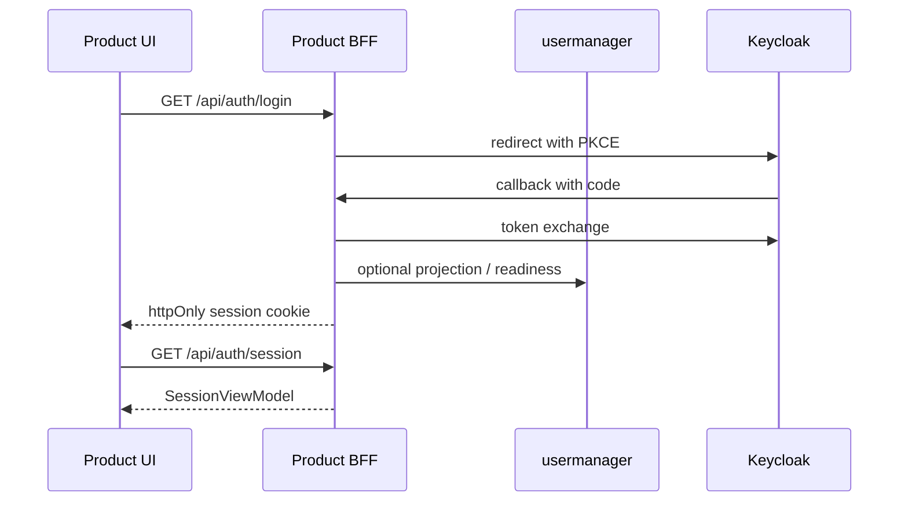
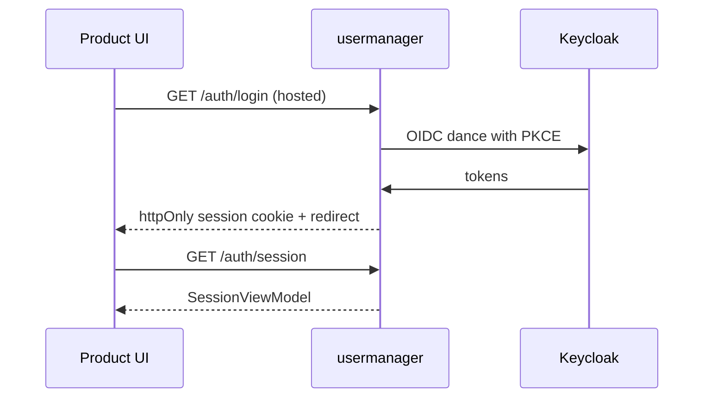

# identity-client recipe for product integration

**Status:** Draft. Companion to the cross-cutting [product-integration-guide.md](../../../docs/testcopilot-arch/platform-app/product-integration-guide.md). Owner: senior-ui-developer + identity-client maintainers.

This document tells a product UI maintainer how to plug `@neoarc/identity-client` into their app for login, session, and gates. Backend contracts are in the [UM API recipe](../../../backend/usermanager/docs/product-integration-um-api.md).

## 1. What this library provides

- **Types:** `SessionViewModel`, `AuthErrorEnvelope`, `IdentityClientAppAdapter`, freshness types - see [`src/session-types.ts`](../src/session-types.ts) and [`src/auth-errors.ts`](../src/auth-errors.ts).
- **Browser surface:** `SessionProvider`, `useSession`, `createAuthFetch`, persona / permission / feature / tenant context helpers (`@neoarc/identity-client/browser`).
- **Server surface:** session helpers for BFF routes (`@neoarc/identity-client/server`).

It does **not** implement OIDC or Keycloak admin operations; those live behind UM and (transitionally) product BFFs.

## 2. Adapter contract

Every product app configures one `IdentityClientAppAdapter` (per [`session-types.ts`](../src/session-types.ts)):

```typescript
import type { IdentityClientAppAdapter } from "@neoarc/identity-client"

export const productIdentityAdapter: IdentityClientAppAdapter = {
  appId: "your-product-id",
  sessionEndpoint: "/api/auth/session",
  loginPath: "/login",
  logoutPath: "/logout",
  callbackPath: "/api/auth/callback",
  contextSwitchEndpoint: "/api/auth/context/switch",
  freshnessEndpoint: "/api/auth/session/freshness",
  forbiddenPath: "/forbidden",
  afterLoginPath: "/home",
  featureNamespace: "your-product",
  permissionNamespace: "your-product",
  tenantContextMode: "multi",
}
```

A worked example is in [`sample-product-identity-adapter.md`](../../neoarc-platform-app/docs/agents/platform-app-agent/sample-product-identity-adapter.md). Coordinate `permissionNamespace` and `featureNamespace` with policy-service and feature-management to avoid colliding with platform-app catalog (gap POLICY-FEATURE-NAMESPACES in the hub doc).

## 3. Two integration shapes (Mode A vs Mode B)

The adapter contract is identical in both modes; what differs is **where the OIDC dance happens**.

### 3.1 Mode A - Product BFF

Product app owns `/api/auth/*` routes. Used by `neoarc-platform-app` today (see [`app/api/auth/login/route.ts`](../../neoarc-platform-app/app/api/auth/login/route.ts), [`app/api/auth/callback/route.ts`](../../neoarc-platform-app/app/api/auth/callback/route.ts)).



**Pros:** works today, works without UM-HOSTED-LOGIN. **Cons:** more auth code per product.

### 3.2 Mode B - UM-hosted session (target)

Product UI calls a UM session endpoint and consumes `SessionViewModel`. Closest to the platform vision; depends on gaps UM-HOSTED-LOGIN and UM-INVITE-REDIRECT (see [hub doc](../../../docs/testcopilot-arch/platform-app/product-integration-guide.md) section 7).



**Pros:** thin product, central session lifecycle. **Cons:** requires UM target endpoints.

A product may start on Mode A and migrate to Mode B without rewriting UI code; both surfaces deliver the same `SessionViewModel`.

## 4. Session DTO contract

Browser receives `SessionViewModel` only:

- `authenticated`, `status`
- `user.id`, `email`, `displayName`, `level`
- `activeTenant`, `availableTenants`
- `rolesPerTenant` (canonical policy role codes), `roleIds`
- Version markers: `claimsVersion`, `contextVersion`
- Step-up / assurance: `reauthenticationRequired`, `assuranceLevel`, `mfaEnabled`, `assuranceMethods`, `authTime`

**Never** expose raw JWT, refresh token, or Keycloak admin URLs to the browser.

## 5. Forbidden imports (library `src/`)

Per [README.md](../README.md), library source must be empty when grepped for app-specific imports:

```bash
rg "from ['\"]@/|neoarc-platform-app|lib/navigation|lib/routes|lib/permissions|app/|components/" src
```

A product app importing the library is fine; the library importing app code is not.

## 6. v0-test-copilot adapter skeleton (documentation only)

When `v0-test-copilot` migrates to the recipe, the adapter would look like:

```typescript
import type { IdentityClientAppAdapter } from "@neoarc/identity-client"

export const testCopilotIdentityAdapter: IdentityClientAppAdapter = {
  appId: "v0-test-copilot",
  sessionEndpoint: "/api/auth/session",
  loginPath: "/login",
  logoutPath: "/logout",
  callbackPath: "/api/auth/callback",
  forbiddenPath: "/forbidden",
  afterLoginPath: "/workspace",
  featureNamespace: "test-copilot",
  permissionNamespace: "test-copilot",
  tenantContextMode: "multi",
}
```

This is documentation only - the migration itself is tracked in the [hub doc](../../../docs/testcopilot-arch/platform-app/product-integration-guide.md) Future alignment section, not executed in this pass.

## 7. Required env vars on the product app

| Var | Mode | Purpose |
|-----|------|---------|
| `NEXT_PUBLIC_APP_ID` (or equivalent) | A + B | Mirrors adapter `appId`; surfaced in diagnostics |
| BFF-side OIDC config (`OIDC_ISSUER_URL`, `OIDC_CLIENT_ID`, `OIDC_CLIENT_SECRET`, `OIDC_REDIRECT_URI`, `OIDC_SCOPES`) | A only | Same shape `neoarc-platform-app` uses; per-product Keycloak client |
| `NEOARC_UM_BASE_URL` | A (when calling UM) and B | Where to call UM session/login endpoints |

Mode B closes most of the per-product OIDC env vars; products only need the UM base URL once UM-HOSTED-LOGIN exists.

## Feedback

*(Human remarks - strikethrough + dated action notes when addressed.)*
